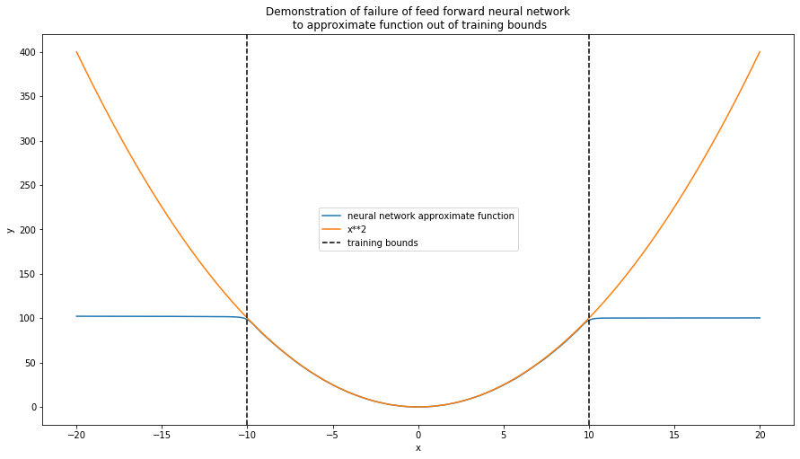

# Using a neural network with inputs out of training bounds

The universal approximation theorem states that:
>  a feed-forward network with a single hidden layer containing a finite number of neurons can approximate continuous functions on compact subsets of Rn, under mild assumptions on the activation function[1]

An important requirement of the universal approximation theorem is that the approximation is limited to compact subsets of Rn, that is a closed subset of Euclidean space. If the trained neural network is used to predict the output of a function given inputs outside of the compact subset on which it was trained it may fail totally to produce a good approximation.

In this notebook we demonstrate this by training a single layer feed forward neural network to approximate the function $y = x^2$. We find that the neural network fails catastrophically to approximate the function outside of its training bounds.

[1]: Balázs Csanád Csáji (2001) Approximation with Artificial Neural Networks; Faculty of Sciences; Eötvös Loránd University, Hungary


```python
%matplotlib inline
import matplotlib.pyplot as plt
import torch
import numpy as np
import torch.nn as nn
import torch.nn.functional as F

def make_data_set(n=1000,func=lambda x: x**2,start=-10,end=10):
    '''make data set of input X and y'''

    X = np.linspace(start,end,n)
    X = torch.tensor(X, dtype=torch.float).reshape([-1,1])
    y = func(X)
    y = torch.tensor(y, dtype=torch.float).reshape([-1,1])
    c = [ "blue"  if x == 0 else "red" for x in y]
    
    return X, y, c

def init_weights(m):
    if type(m) == nn.Linear:
        torch.nn.init.xavier_uniform(m.weight)
        m.bias.data.fill_(0)

class Net(nn.Module):
    def __init__(self, input_size, hidden_size,num_classes):
        super(Net, self).__init__()                    # Inherited from the parent class nn.Module
        self.fc1 = nn.Linear(input_size, hidden_size,bias=True)  # 1st Full-Connected Layer: 784 (input data) -> 500 (hidden node)      
        self.fc2 = nn.Linear(hidden_size, 1,bias=True)
        self.sig = nn.Sigmoid()
  
        self.apply(init_weights)

    
    def forward(self, x):                              # Forward pass: stacking each layer together
        out = self.fc1(x)
        out = self.sig(out)
        out = self.fc2(out)

        return out

def train_network(X,y):
    '''train single hidden layer network'''
    # Set network parameters
    input_size = 1       # The image size = 28 x 28 = 784
    hidden_size = 50     # The number of nodes at the hidden layer
    num_classes = 1       # The number of output classes. In this case, from 0 to 9
    num_epochs = 5000         # The number of times entire dataset is trained
    batch_size = 100       # The size of input data took for one iteration
    learning_rate = 1  # The speed of convergence


    net = Net(input_size, hidden_size, num_classes)
    criterion = nn.MSELoss()
    optimizer = torch.optim.Adam(net.parameters(), lr=learning_rate)

    for epoch in range(num_epochs):
        optimizer.zero_grad()                             # Intialize the hidden weight to all zeros
        outputs = net(X)                             # Forward pass: compute the output class given a image
        loss = criterion(outputs, y)                 # Compute the loss: difference between the output class and the pre-given label
        loss.backward()                                   # Backward pass: compute the weight
        optimizer.step()                                  # Optimizer: update the weights of hidden nodes
        
    return net

def plot_results(X,y,preds,lower_bound=-10,upper_bound=10):
    '''plot actual y vs output of neural network estimator'''
    
    fig, ax = plt.subplots(figsize=(15,8))
    ax.plot(X_test,preds.detach().numpy(),label="neural network approximate function")
    ax.plot(X_test,y_test,label="x**2")
    ax.axvline(lower_bound,color="black",linestyle="--",label="training bounds")
    ax.axvline(upper_bound,color="black",linestyle="--")
    ax.legend(loc="center")
    ax.set_xlabel("x")
    ax.set_ylabel("y")
    ax.set_title("Demonstration of failure of feed forward neural network\n to approximate function out of training bounds")
```


```python
# Make training and test sets

start_train=-10
end_train=10
start_test=-20
end_test=20

X_train, y_train, c_train = make_data_set(start=start_train,end=end_train)
X_test, y_test, c_test = make_data_set(start=start_test,end=end_test)

# Train nework
net = train_network(X_train,y_train)
```

    C:\Users\patri\AppData\Local\Continuum\anaconda3\envs\MITx_ML\lib\site-packages\ipykernel_launcher.py:14: UserWarning: To copy construct from a tensor, it is recommended to use sourceTensor.clone().detach() or sourceTensor.clone().detach().requires_grad_(True), rather than torch.tensor(sourceTensor).
      
    C:\Users\patri\AppData\Local\Continuum\anaconda3\envs\MITx_ML\lib\site-packages\ipykernel_launcher.py:21: UserWarning: nn.init.xavier_uniform is now deprecated in favor of nn.init.xavier_uniform_.
    


```python
# make predictions on test set
preds_test = net(X_test) 

plot_results(X_test,y_test,preds_test)
```




